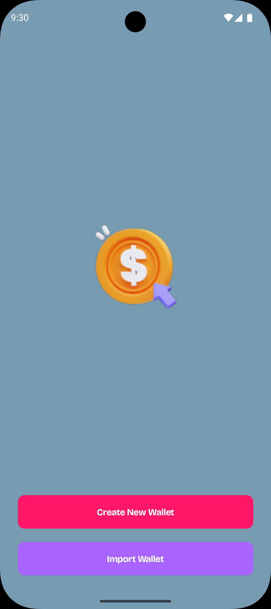
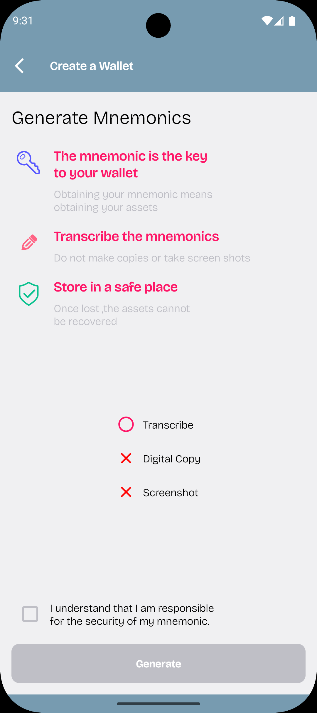
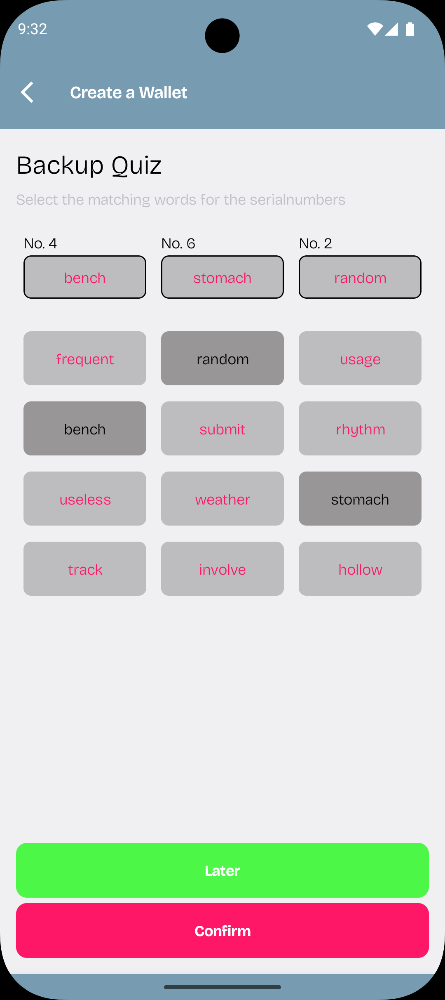
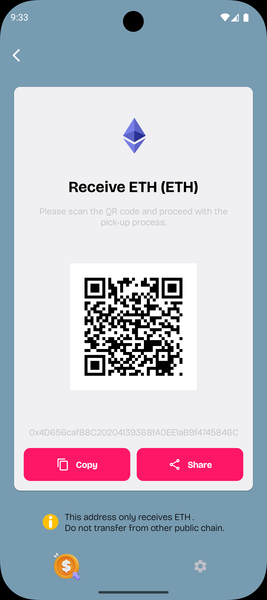
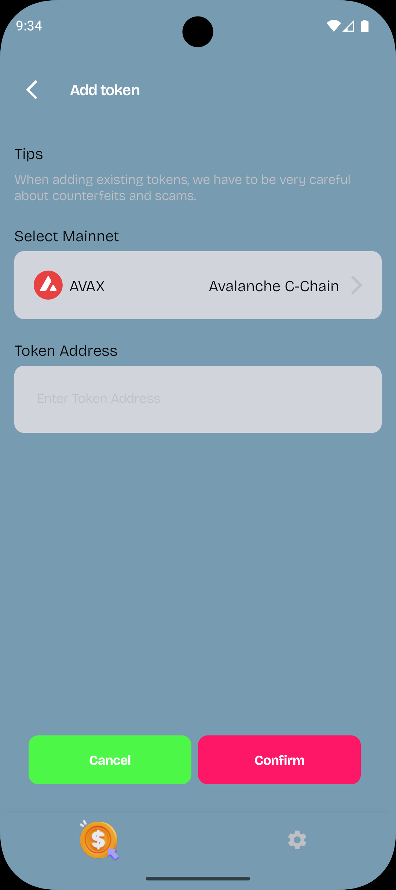
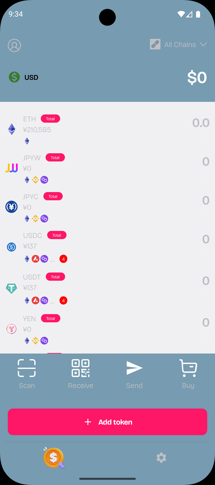
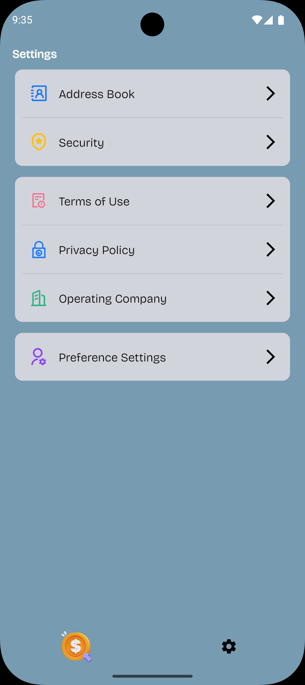

## CoinPay

An unofficial crypto wallet app like MetaMask. It has all the features a wallet needs.
<table>
  <tr>
    <td>
      
      
      
    </td>
  </tr>
  <tr>
    <td>
      
      
      
    </td>
  </tr>
  <tr>
    <td>
      
    </td>
  </tr>
</table>

<li>Create and Import wallet</li>
<li>Send and Recieve coins with support of multiple blockchains like Ethereum, Bitcoin, Selenium etc.</li>
<li>Add custom tokens manually along with provided ones.</li>
 
 
Release: <a href="https://github.com/zeeshanali-k/CoinPay/releases">Download APK Here</a>
